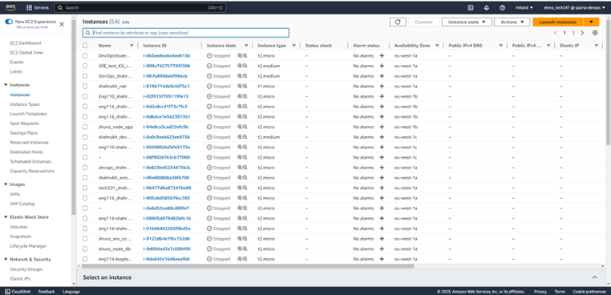
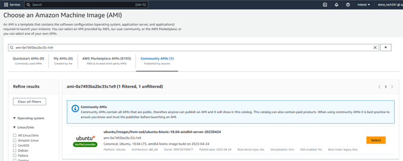
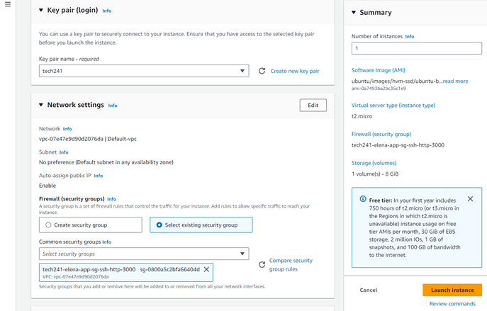
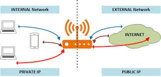
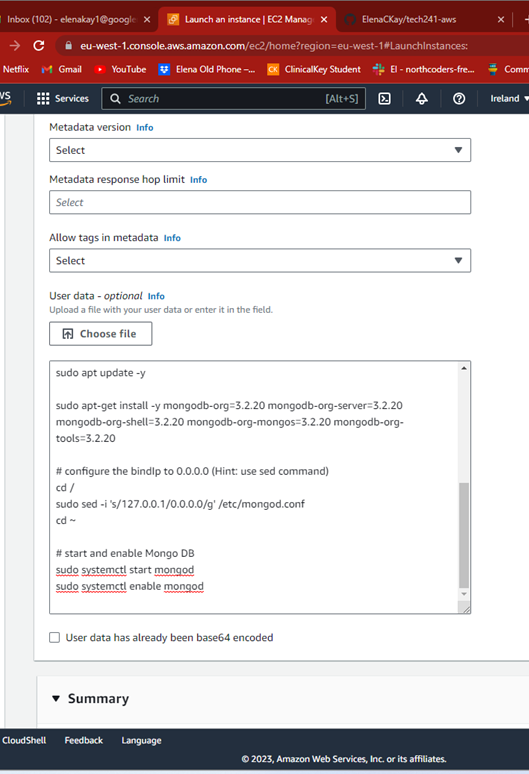
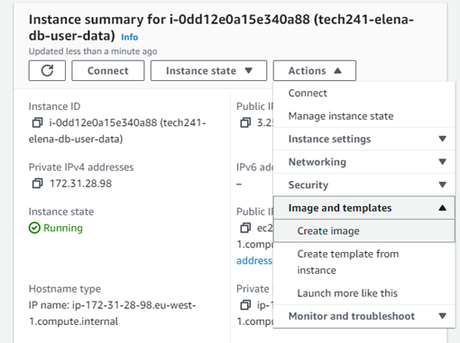

# AWS

- EC2 VM -> similar to azure VMs
- S3 buckets -> similar to azure blob storage
- Can use python to manipulate S3 buckets

## Differences between AWS and Azure

- resource groups
  - In Azure, everything must go into a resource group
  - In AWS, they are not necassary 
- IP Address
  - In Azure, by default uses static -> doesnt change
  - In AWS, by default uses dynanmic -> changes everytime your VM restarts
- Terminology
  - Launch on aws is create on azure
  - ubuntu not adminuser
  - terminate not delete

**Do NOT LEAK credentials for AWS. This is in a folder in .ssh. **

## ssh key pair creation

- type key pair into the search bar
- select key pair EC2
- tech241 is our key pair
- it is an RSA type
- pem file as it is ssh
- If creating the key; you would download the pem file which is the private key and it keeps the public one

## Instances in AWS (Creating a VM)

When on the aws console home be in the **Ireland** region. This region is reserved for training. 

- Go into EC2.
- Instances running -> shows how many VMs are running. Also can click on this to go to the VMs and make one.
- Launch instances

- Give the vm a name
- Choose an img -> OS
  - search for Ubuntu 18.04 LTS 1e9
  - ubuntu/images/hvm-ssd/ubuntu-bionic-18.04-amd64-server-20230424
  - id: ami-0a7493ba2bc35c1e9

- Instance type is t2.micro
- Key pair is tech241
- Has a default virtual network
- Create a new security group - this will be reused 
- set to anywhere 0.0.0.0 -> not the best practice but is okay for training
- edit network settings to allow port 3000 rule
  - name: tech241-elena-app-sg-ssh-http-3000 (sg stands for security group)
  - description: tech241-elena-app-sg-ssh-http-3000 for sparta app
  - add security group rule 
    - port range 3000
    - TCP
    - Source type: Anywhere
    - description: Sparta app

- Leave default for configure storage
- Leave advanced details
- Launch instance!
- It gives you an ID so you can go to the correct VM and it is running

## Connecting to VM

- Click connect
- SSH tab
- The privite ssh key is in the .ssh folder
- `chmod 400 tech241.pem` -> Git bash still gave others and group read permissions because it isnt proper linux
- `ssh -i "~/.ssh/tech241.pem" ubuntu@ec2-176-34-86-235.eu-west-1.compute.amazonaws.com`
  - the ip address will change every time so you cannot reuse the command

## Delete VM

- Terminate means delete 
- located in instance state 

## Deploying scripts in AWS

As I am creating two VMs I created a txt file which says I am the app in the home directory of the app VM. I alos created on for the database VM.

In both VMs I created the provison.sh file and by using `nano` and then copied and pasted the relevent scripts from my github repo 'Deploying and Automating'. I then give myself execute permissions using `chmod u+x provision.sh` . I first ran the database script `./provision.sh` . This needed to be run twice to work? I may need a restart for mongodb in there somewhere. Then I ran the app script `./provison.sh`. Then I checked to see if they worked by going to the public app IP address and seeing if the homepage and the posts page came up which they did. 

## Difference between public and privite IP address

Coming into the VM from the outside you can use the publicIP address. To connect the two VMs we have been using the public database IP addess but this changes everytime so it cannot be automated. Using a public ip address is like going outside and entering again and it means you are no longer trusted and you have to pass the NSG rules. 

To overcome this use the private Ip address. When we do this it means the two NIC in the two VMs can communicate. This means the two machines can trust each other and they dont need the rules. So you dont need the 27017 port rule anymore. Use the private Ip address in the environment variable. This will only work if both VMs are in the same virtual networks.

## Adding user data

So that the VM will run the database script straight away, in advanced settings, under user data, paste in the data base script. It will only run *ONCE!* When this is done launch the VM.

The new vm is called tech241-elena-db-user-data. Connect using this command:

  `ssh -i "~/.ssh/tech241.pem" ubuntu@ec2-3-251-71-144.eu-west-1.compute.amazonaws.com`

When I connected I checked if it worked by checking the status of mongodb and if the bind ip has changed and it worked.

## AMI - Amazon Machine Image

An Amazon Machine Image (AMI) is a template that contains a software configuration (for example, an operating system, an application server, and applications). From an AMI, you launch an instance, which is a copy of the AMI running as a virtual server in the cloud.

AMIs cost less to run then a virtual machine.

### Making a AMI

1. Search EC2
2. Left column has images and under that is AMIs -> This how you find an ami
3. To create on go to instances
4. Pick the instance you want to make an ami of
5. Actions
6. Image and templates
7. Create Image

8. Give it a name and description and tag
9. Create it

When this is done you can launch an instance from it. This means that you dont need an OS as it is already chosen. When you ssh in it says login as ubuntu not root. To stop this change root to ubuntu:

`ssh -i "~/.ssh/tech241.pem" root@ec2-54-170-127-17.eu-west-1.compute.amazo.com`

to 

`ssh -i "~/.ssh/tech241.pem" ubuntu@ec2-54-170-127-17.eu-west-1.compute.amazo.com`

## Monitering

Detailed monitoring sends you data every minute.

### Creating alert
1. Go to the CloudWatch console at https://console.aws.amazon.com/cloudwatch/
2. Go to Alarms, All Alarms
3. Create alarm
4. Select metric
5. Select GetDashboard CloudWatch metric
6. Set conditions for the metric
7. Set notifications

### Dashboard

To set up a dashboard you can go to the instance you want a dashboard of and then set up a dashboard.

## S3 Simple storage service

Like blob storage in azure. Used to store content on the cloud in a robust way over multiple regions if you like. Instead of container it is bucket. Don't touch the buckets already there. The region is global.

## Scaling 

What happens if the CPU load is too high? It will delay and crash.

How to stop this?

1. CW monitering - watch it on the dashboard
2. CW monitering - set an alarm and it will give a notification
3. CW monitering - autoscaling - it will automatically scale depending on different aspects for example CPU load. More VMs may be used to scale up.

AWS Auto scaling group 

VM -> AMI -> Launch template

The template has all of the details filled in and is used for an autoscaling group. It needs to know all the details for the vm it is going to make to handle the change in CPU. It needs to know the threshold of when to create a new instance -> this is the scaling policy. Example: CPU > 50% launch more instances. It needs to know the minimum number of vms. In our case it will be two. It needs a maximum as well as it will be too expenive to run lots. In our case it is three.

Scaling policy breakdown:

- CPU 50%
- Min 2
- Desired 2
- Max 3

Internet facing so traffic comes in and goes through the load balancer. The VMs should be in different avalibility zones.

Steps to make auto scaling group working:

- Create DB VM
- Create App VM
- Create AMI of the app
- Create Launch template using AMI
- Test the launch template
- Create ASG

### Create DB VM
This is the first step as the app needs to connect to it in order fror the posts page to work. It will also give the private IP address which is needed in the app script for the app vm. Make sure the db vm instance is running. I used the one already created where the user data contained the db script.

### Create App VM
I created an APP VM ensuring that the user data had the correct script with the DB IP environment variable. I then checked it was running correctly and the posts page worked which meant it was connected to the DB.

### Create AMI of the App VM
This is like a replica of the disk within the App VM. It has all of the dependencies , folders, OS ready to go. To test this you can create an instance from the ami and go to the ip address and see if it is running the app.

### Create Launch Template using AMI
A launch template contains all of the details for a particular ami to run. This includes NSG rules, instance type, key pair, network settings and the user data script. As the AMI already has all the dependencies and folders, the user data just needs to run the app. This new script is in the app_script_only_start_app.md. Using a launch template saves lots of time as you dont need to fill in any details and the script is a lot shorter.

### Test the launch template
To do this create an instance using the launch template. It should run quite quickly compared to a normal VM or AMI. If it runs with the posts page, it is successful.

### Create ASG
The auto scaling group, uses the launch template to create instances depending on the configuration of the scaling policies. For example: we set it so if the CPU reaches over 50% then it will create another instance. The minimum is 2 and the maximum is 3.

