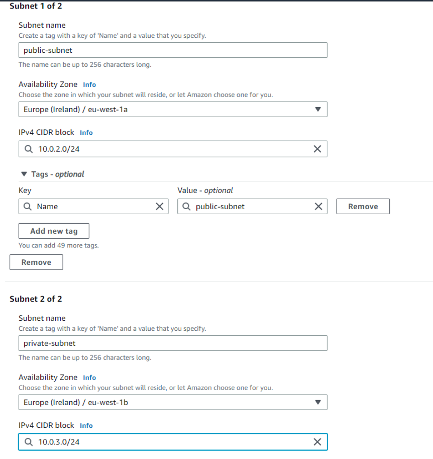

# VPC - Virtual private cloud

VPC is like your own private house with rooms in it which you can set to be private or public. To reach the public room you need to set up a path. The path represents a route.

In AWS you still need the MongoDB port even with using the private ip address.
Even if you allow ssh on a private subnet you cant get in as there is no route. 
If you have subnets within a VPC and one is private you can ssh into a public one and then use that to ssh into the private one. Internal routing is allowed.
CIDR block: 
- VPC 10.0.0.0/16
- Public 10.0.2.0/24
- Private 10.0.3.0/24
  

The red arrows represent requests coming in accessing from the internet. These can be potentially dangerous. The blue represent requests and connections between the two VMs, as they are both within the VPC they are safe.

## Creating a VPC

1. go to VPC 
2. create VPC
3. Give it a name
4. change the CIDR block to 10.0.0.0/16
5. click create
6. create internet gateway
7. give it a name and create it
8. click on actions -> attach to VPC
9. select the correct VPC and the click attach
10. Create subnets 
11. Select VPC
12. name one public-subnet
13. give it a zone
14. CIDR block = 10.0.2.0/24
15. add new subnet
16. name it private-subnet
17. give it a zone
18. CIDR block = 10.0.3.0/24
    

19. Create route table

1.  Add routes
2.  Subnet associations
3.  edit subnet associations
4.  select to public one

23. edit routes
24. destination - anywhere
25. target Internet gateway then select yours

### Overview of the VPC:

## Adding DB VMs to the VPC

1. EC2 instances 
2. Instances
3. Launch instance 
4. name it db-vpc
5. my amis use the ami with user data db
6. t2 micro
7. tech241 - key pair name
8. security group change vpc to the one I set up
9. private subnet 
10. create security group
11. give it the same name as the VM + sg + 27017
12. give it the port 27017 rule
13. user data script doesnt need anything - we are using an API which already has all of the dependencies
14. launch instance

## Adding App VMs to the VPC

1. EC2 instances 
2. Instances
3. Launch instance 
4. name it app-only-vpc
5. my amis use the ami with asg
6. t2 micro
7. tech241 - key pair name
8. security group change vpc to the one i set up
9. public subnet 
10. enable public ip address
11. create security group
12. give it the same name as the VM + sg + SSH + HTTP + 3000
13. add ssh + http source anywhere
14. custom TCP , anywhere, port 3000
15. user data script use the one that only starts the app -> remember to change the ip address to the db one!
16. launch instance
17. go to instance
18. copy ip address go to the site

## What is a VPC?
A Virtual Private Cloud (VPC) is a virtual network infrastructure provided by cloud service providers like Amazon Web Services (AWS). It allows users to create a logically isolated section within the cloud where they can launch and configure cloud resources such as virtual machines, databases, and load balancers.

## Why VPCs are used?
VPCs are used to achieve several key objectives:

- Isolation and Security: VPCs provide a secure and isolated environment for running applications and services. They allow users to define their own network topology, subnets, and security controls to ensure that their resources are protected from unauthorized access.

- Custom Networking: VPCs enable users to design and control their network architecture, including the selection of IP address ranges, creation of subnets, and configuration of routing tables. This flexibility allows organizations to build complex and scalable network infrastructures that suit their specific requirements.

- Connectivity: VPCs provide connectivity options to establish connections between resources within the VPC and with external networks. Users can connect their VPCs to their on-premises data centers or other VPCs using virtual private network (VPN) connections or dedicated connections.

- Scalability: VPCs allow users to scale their infrastructure easily. Users can add or remove resources within the VPC as needed without impacting other parts of the infrastructure. This scalability enables businesses to accommodate changing demands and handle increased traffic or workloads effectively.

## Benefits of VPCs
- Improved Security: VPCs provide network isolation, allowing organizations to implement fine-grained security controls using security groups, network ACLs (Access Control Lists), and other security features. This ensures that resources within the VPC are protected from unauthorized access.

- Custom Networking: VPCs offer flexibility in designing and managing network architecture. Users can define their own IP address ranges, create subnets, and configure routing tables to meet specific requirements. This customization allows for the creation of complex network topologies and supports the implementation of advanced networking features.

- Easy Connectivity: VPCs enable connectivity between resources within the VPC and with external networks. Users can establish VPN connections or use dedicated connections to connect their VPCs to on-premises data centers or other VPCs, providing a seamless and secure hybrid cloud environment.

- Scalability and Elasticity: VPCs support horizontal scalability, allowing businesses to add or remove resources easily as needed. This scalability enables organizations to handle increased workloads, traffic spikes, and growth without disruption.

- Cost Optimization: By using VPCs, organizations can optimize costs by selecting the appropriate instance types, managing network traffic efficiently, and utilizing features like Auto Scaling. This helps to minimize infrastructure expenses while maintaining the required performance and reliability.

## How VPCs Help Businesses
VPCs offer several advantages that help businesses in various ways:

- Security and Compliance: VPCs provide a secure environment that helps businesses meet security and compliance requirements. Organizations can implement granular security controls and access management, ensuring that sensitive data and applications are protected.

- Flexibility and Customization: VPCs offer flexibility in designing and customizing network architectures. Businesses can tailor their VPC to match their specific needs, enabling them to deploy applications and services in a way that aligns with their business requirements.

- Scalability and Agility: VPCs support scalability, allowing businesses to quickly adapt to changing demands and scale their infrastructure as needed. This agility helps organizations respond to market conditions, handle increased workloads, and deliver services more effectively.

- Hybrid Cloud Integration: VPCs facilitate hybrid cloud integration by allowing businesses to establish secure connections between their cloud resources and on-premises infrastructure. This enables seamless data and workload migration, hybrid application deployments, and efficient utilization of existing IT investments.

## How VPCs Help DevOps
VPCs provide several benefits to DevOps teams, including:

- Infrastructure as Code: VPCs can be provisioned, configured, and managed using infrastructure-as-code (IaC) tools like AWS CloudFormation or Terraform. This allows DevOps teams to define the desired VPC configuration as code, enabling automated and repeatable deployments.

- Automation and Orchestration: VPCs can be integrated with DevOps automation and orchestration tools to streamline the deployment and management of infrastructure. This includes automating the creation of VPC resources, configuring networking components, and establishing connectivity.

- Environment Isolation: VPCs provide isolated environments for different stages of development, such as development, testing, and production. DevOps teams can create separate VPCs for each stage, ensuring that changes and updates in one environment do not impact others.

- Scalable and Resilient Architecture: VPCs support the creation of scalable and resilient architectures. DevOps teams can leverage features like Auto Scaling, elastic load balancing, and multi-Availability Zone deployments within VPCs to achieve high availability and fault tolerance for their applications.

- Monitoring and Troubleshooting: VPCs offer monitoring and logging capabilities to track network traffic, security events, and performance metrics. DevOps teams can utilize these features to troubleshoot issues, optimize resource utilization, and ensure the smooth operation of their infrastructure.

## Why AWS Introduced VPCs
AWS introduced VPCs to address the need for more control, security, and flexibility over network infrastructure within the cloud. Before VPCs, AWS provided a flat network model where all instances shared a common network space, limiting the ability to create isolated environments and control network traffic effectively.

By introducing VPCs, AWS allowed customers to define their own virtual networks, create subnets, and configure routing tables, providing greater control and customization options. VPCs also offered enhanced security features like security groups and network ACLs, allowing users to enforce fine-grained access controls.

Moreover, VPCs enabled businesses to seamlessly integrate their cloud resources with on-premises infrastructure through VPN or dedicated connections, facilitating hybrid cloud scenarios. This flexibility and connectivity options provided by VPCs aligned with the evolving needs of organizations, allowing them to build complex, secure, and scalable architectures in the AWS cloud.